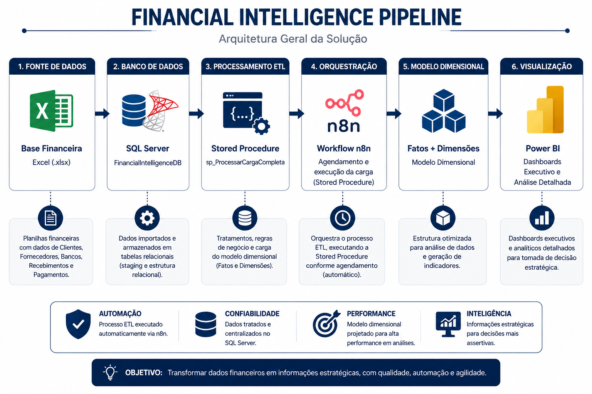

# 💼 Financial Intelligence Pipeline

### End-to-End Financial Intelligence Solution using SQL Server, Power BI, n8n and Dimensional Modeling

---

## 📌 Overview

The **Financial Intelligence Pipeline** is an end-to-end Business Intelligence project designed to automate the ingestion, transformation, modeling and visualization of financial data.

The solution combines **SQL Server**, **Stored Procedures**, **n8n**, **Power BI** and **Dimensional Modeling** to build a reliable analytical environment capable of supporting executive decision-making.

---

## 🎯 Project Objectives

- Automate the ETL process
- Standardize financial data
- Build a dimensional model
- Deliver executive dashboards
- Provide operational analysis
- Centralize business rules in SQL Server
- Automate execution using n8n

---

## 🛠 Technologies

| Technology | Purpose |
|------------|---------|
| SQL Server 2022 | Relational database and ETL processing |
| T-SQL Stored Procedures | Business rules, transactional processing and data loading |
| n8n | ETL workflow orchestration and scheduling |
| Power BI Desktop | Executive and analytical dashboards |
| DAX | KPIs, Time Intelligence and Smart Tooltips |
| Dimensional Modeling | Star Schema (Facts & Dimensions) |
| CSV Files | Source data |
| Git & GitHub | Version control and project documentation |

---

## 🏗️ Solution Architecture

The following diagram illustrates the complete architecture of the Financial Intelligence Pipeline.

The solution starts with CSV source files, loads the data into SQL Server through reusable Stored Procedures, orchestrates the ETL with n8n, applies dimensional modeling, and finally delivers executive analytics in Power BI.

    

