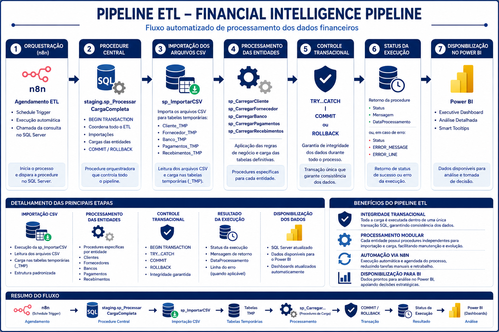
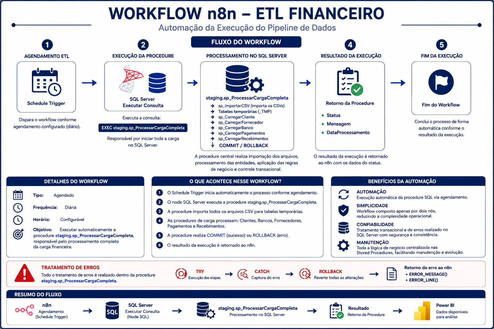
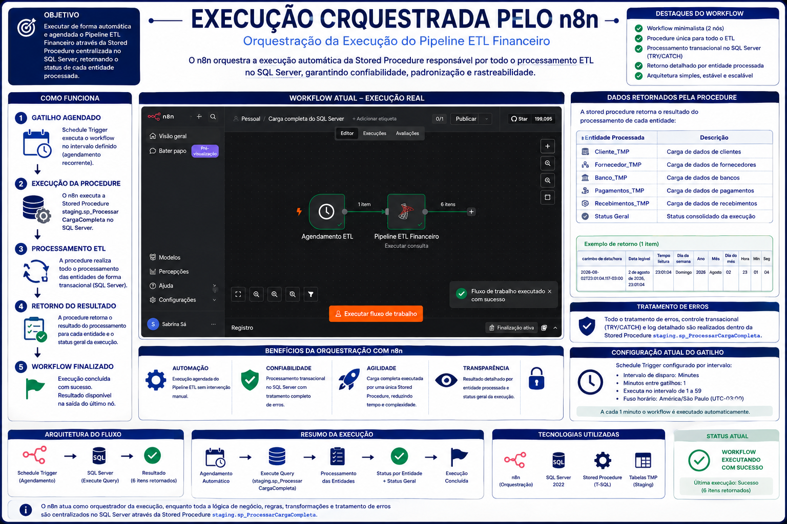
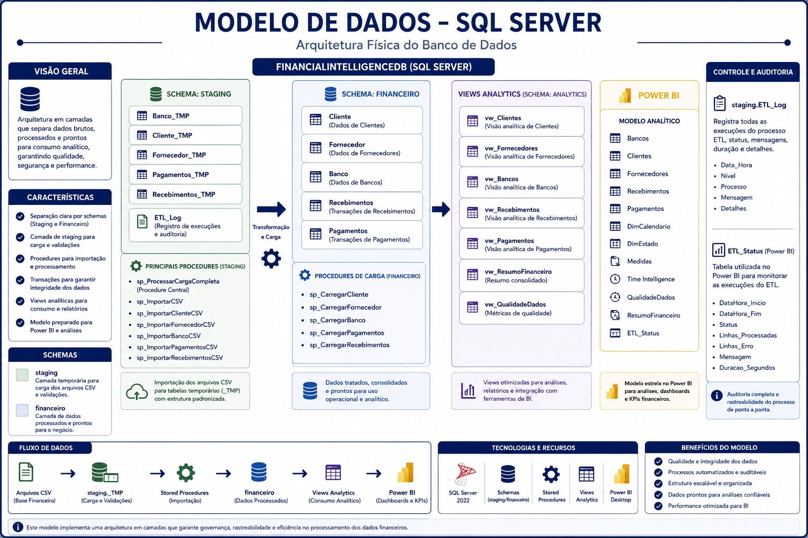
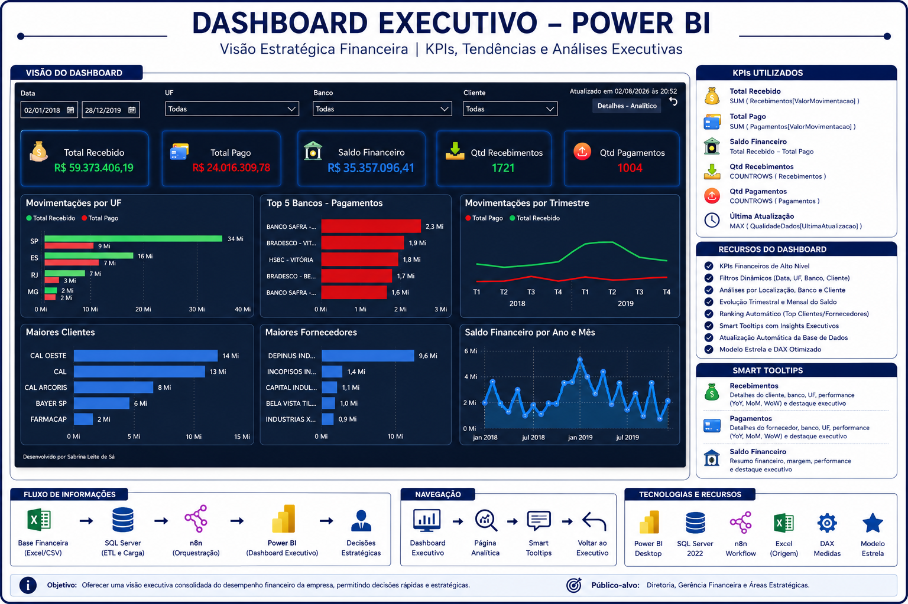
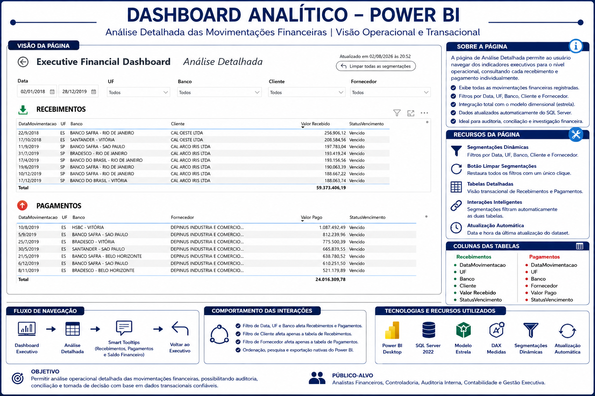
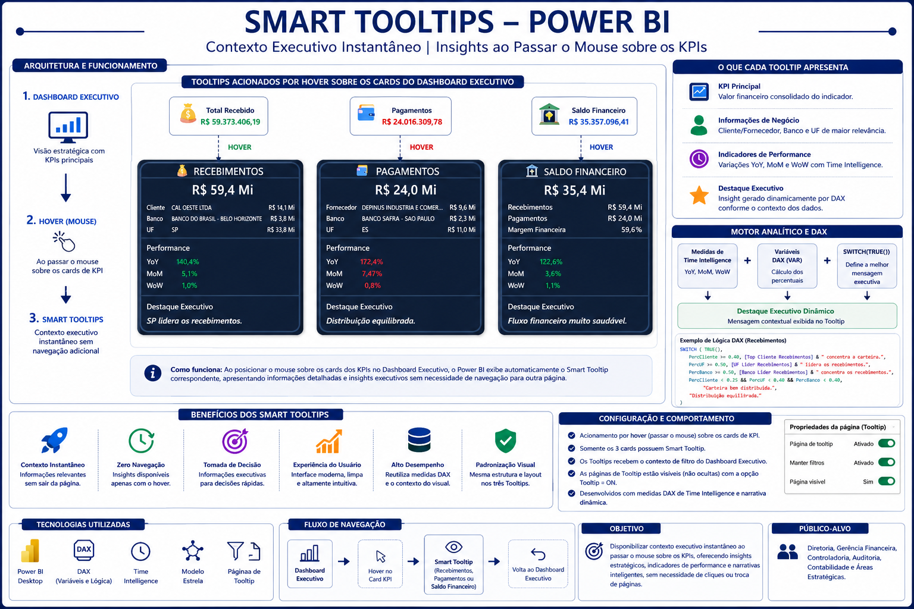

# 💼 Financial Intelligence Pipeline

### End-to-End Financial Intelligence Solution using SQL Server, Power BI, n8n and Dimensional Modeling

---

## 📌 Overview

The **Financial Intelligence Pipeline** is an end-to-end Business Intelligence project designed to automate the ingestion, transformation, modeling and visualization of financial data.

The solution combines **SQL Server**, **Stored Procedures**, **n8n**, **Power BI** and **Dimensional Modeling** to build a reliable analytical environment capable of supporting executive decision-making.

---

## 🎯 Project Objectives

- Automate the ETL process
- Standardize financial data
- Build a dimensional model
- Deliver executive dashboards
- Provide operational analysis
- Centralize business rules in SQL Server
- Automate execution using n8n

---

## 🛠 Technologies

| Technology | Purpose |
|------------|---------|
| SQL Server 2022 | Relational database and ETL processing |
| T-SQL Stored Procedures | Business rules, transactional processing and data loading |
| n8n | ETL workflow orchestration and scheduling |
| Power BI Desktop | Executive and analytical dashboards |
| DAX | KPIs, Time Intelligence and Smart Tooltips |
| Dimensional Modeling | Star Schema (Facts & Dimensions) |
| CSV Files | Source data |
| Git & GitHub | Version control and project documentation |

---

## 🏗️ Solution Architecture

The following diagram illustrates the complete architecture of the Financial Intelligence Pipeline.

The solution starts with CSV source files, loads the data into SQL Server through reusable Stored Procedures, orchestrates the ETL with n8n, applies dimensional modeling, and finally delivers executive analytics in Power BI.

<p align="center">
    
</p>

---

## 🔄 ETL Pipeline

The ETL process is fully orchestrated using reusable SQL Server Stored Procedures and automated through n8n.

The pipeline follows a modular architecture where each entity is imported, validated and processed independently before being loaded into the dimensional model.

### Main processing flow

1. Import CSV files into staging tables.
2. Validate data integrity and business rules.
3. Process entities through dedicated Stored Procedures.
4. Execute the complete transactional workflow.
5. Load data into dimensional tables.
6. Make the data available for Power BI dashboards.

<p align="center">
    
</p>

---

## ⚙️ Workflow Automation (n8n)

The execution of the ETL pipeline is fully automated using n8n.

The workflow is responsible for scheduling the execution, triggering SQL Server Stored Procedures and monitoring the execution status, reducing manual intervention and ensuring process consistency.

<p align="center">
    
</p>

<p align="center">
    
</p>

---

## 🗄️ Dimensional Data Model

The Financial Intelligence Pipeline uses a Star Schema dimensional model to optimize analytical queries and Power BI performance.

The model separates transactional data into Facts and Dimensions, providing scalability, consistency and high-performance reporting.

### Main Components

- Fact Tables
- Dimension Tables
- Business Keys
- Surrogate Keys
- Referential Integrity
- Optimized relationships for analytics

<p align="center">
    
</p>

---

## 📊 Executive Dashboard

The Executive Dashboard provides a high-level business overview through interactive KPIs and performance indicators.

Main features include:

- Executive KPIs
- Financial indicators
- Operational performance
- Dynamic filters
- Interactive navigation

<p align="center">
    
</p>

---

## 📈 Analytical Dashboard

The Analytical Dashboard allows detailed operational analysis through drill-downs, segmentation and advanced filtering.

Main features include:

- Detailed analysis
- Interactive visualizations
- Business segmentation
- Performance comparisons
- Dynamic filtering

<p align="center">
    
</p>

---

## 💡 Smart Tooltips

Custom Power BI tooltips provide contextual information to improve data interpretation without overcrowding dashboard visuals.

Benefits include:

- Better user experience
- Contextual KPIs
- Additional operational information
- Faster decision making

<p align="center">
    
</p>

---

# 📁 Project Structure

```text
Financial-Intelligence-Pipeline
│
├── Entrada/
│   ├── Banco.csv
│   ├── Cliente.csv
│   ├── Fornecedor.csv
│   ├── Pagamentos.csv
│   └── Recebimentos.csv
│
├── Docs/
│   └── Slides/
│       ├── 01_Arquitetura_Geral.png
│       ├── 02_Dashboard_Executivo.png
│       ├── 03_Dashboard_Analitico.png
│       ├── 04_Smart_Tooltips.png
│       ├── 05_Modelo_Dados_SQL.png
│       ├── 06_Pipeline_ETL.png
│       ├── 07_Workflow_n8n.png
│       └── 08_Execucao_orquestrada_n8n.png
│
├── Power BI/
│   └── Financial Intelligence Dashboard.pbix
│
├── Processados/
│
├── Erros/
│
├── Backup/
│
├── Icones/
│
├── Carga Completa SQL Server.json
│
├── README.md
│
└── LICENSE
```

### Folder Description

| Folder | Description |
|---------|-------------|
| Entrada | CSV source files used by the ETL pipeline |
| Docs | Project documentation and architecture diagrams |
| Power BI | Power BI dashboard (.pbix) |
| Processados | Successfully processed files |
| Erros | Files rejected during validation |
| Backup | Backup copies generated during processing |
| Icones | Icons used in the dashboards |

---

# ▶️ How to Run

Follow the steps below to execute the Financial Intelligence Pipeline.

## 1. Clone the repository

```bash
git clone https://github.com/sabbrinaa-cloud/financial-intelligence-pipeline.git
```

---

## 2. Prepare the environment

Install the following software:

- SQL Server 2022
- SQL Server Management Studio (SSMS)
- Power BI Desktop
- n8n
- Git

---

## 3. Configure the SQL Server environment

Create the SQL Server database according to the architecture presented in this repository.

The ETL solution uses:

- Staging tables
- Dimension tables
- Fact tables
- SQL Server Stored Procedures

---

## 4. Load the source files

Copy the CSV files into the **Entrada/** folder.

```text
Banco.csv
Cliente.csv
Fornecedor.csv
Pagamentos.csv
Recebimentos.csv
```

---

## 5. Execute the ETL Workflow

Import the workflow file:

```text
Carga Completa SQL Server.json
```

into **n8n** and execute the workflow.

The automation will:

- Execute the SQL Server Stored Procedures
- Import the CSV files
- Process business rules
- Load the dimensional model
- Return the execution status

---

## 6. Open the Power BI Dashboard

Open the following file:

```text
Power BI/Financial Intelligence Dashboard.pbix
```

Refresh the data model to visualize the processed information.

---

# ✅ Expected Result

After the execution, the solution delivers:

- Executive Dashboard
- Analytical Dashboard
- Smart Tooltips
- Dimensional Data Model
- Automated ETL Pipeline
- Financial data ready for business analysis

---

# 📚 Key Learnings

Developing the Financial Intelligence Pipeline provided valuable hands-on experience across multiple areas of Business Intelligence and Data Engineering.

Throughout this project, I strengthened my knowledge in:

- Designing relational and dimensional data models (Star Schema)
- Building reusable SQL Server Stored Procedures
- Creating staging environments for ETL processing
- Implementing transactional control using TRY...CATCH, COMMIT and ROLLBACK
- Automating ETL execution with n8n workflows
- Developing interactive Power BI dashboards with DAX measures and Smart Tooltips
- Organizing projects using Git and GitHub version control
- Structuring technical documentation following software engineering best practices
- Applying business rules to transform raw data into reliable analytical information
- Building an end-to-end Business Intelligence solution from data ingestion to executive reporting

This project also reinforced the importance of designing scalable, maintainable and well-documented data solutions capable of supporting business decision-making.

---

# 🚀 Future Improvements

The Financial Intelligence Pipeline already delivers a complete end-to-end Business Intelligence solution. Future enhancements are planned to improve scalability, automation and analytical capabilities.

## Planned Improvements

- Automate the ingestion of CSV files directly from cloud storage.
- Publish the Power BI dataset to Power BI Service with scheduled refresh.
- Implement automatic email notifications after each ETL execution.
- Create historical execution logs and monitoring dashboards.
- Implement data quality validation before loading the dimensional model.
- Expand the analytical dashboards with new business KPIs.
- Integrate AI-powered insights to identify financial trends and anomalies automatically.
- Containerize the solution using Docker for simplified deployment.
- Implement CI/CD pipelines using GitHub Actions.
- Extend the architecture to support Microsoft Fabric and Azure Data Factory.
- Replace CSV source files with database or REST API integrations.
- Implement Row-Level Security (RLS) in Power BI.
- Create automated unit tests for SQL Server Stored Procedures.

## Long-Term Vision

Transform the Financial Intelligence Pipeline into a scalable Business Intelligence platform capable of processing larger datasets, integrating cloud services and supporting advanced analytics while maintaining modularity, automation and data governance.

---

# 👩‍💻 About the Author

Hi! I'm **Sabrina Sá**, a Business Intelligence and Data Analytics professional passionate about transforming data into strategic insights.

With over 15 years of experience in the Telecommunications industry, I have developed expertise in data governance, business processes, performance analysis and executive reporting. Today, my focus is on designing end-to-end Business Intelligence solutions by combining SQL Server, Power BI, ETL automation and analytics to support data-driven decision-making.

The **Financial Intelligence Pipeline** represents the integration of several technologies and best practices in a single project, demonstrating my ability to design, automate and document complete analytical solutions.

## Connect with me

- 💼 LinkedIn: https://www.linkedin.com/in/sabrinaleitesa/
- 💻 GitHub: https://github.com/sabbrinaa-cloud
- 🌐 Portfolio: https://sites.google.com/edu.senai.br/portfolio-sabrina-sa/in%C3%ADcio

Thank you for visiting this project!

If you found it interesting, feel free to connect or leave a ⭐ on the repository.
